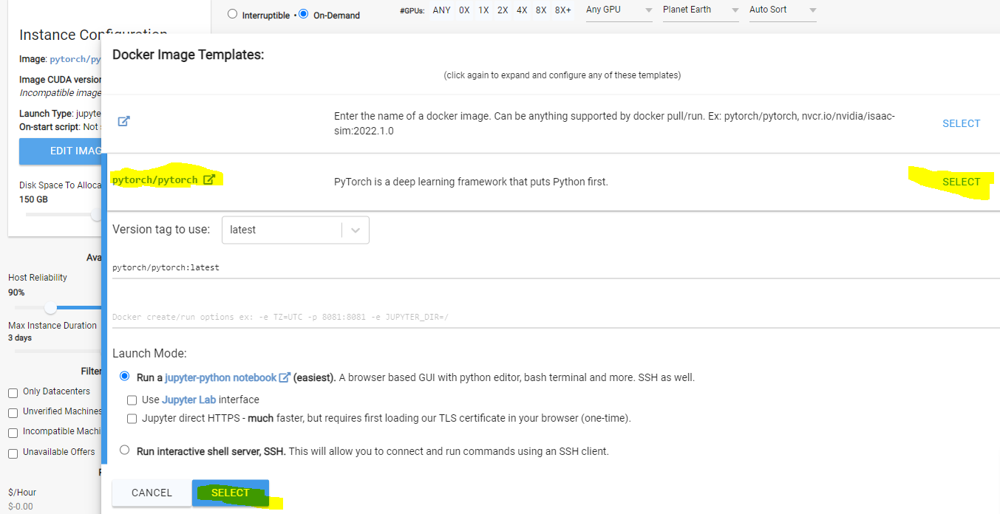
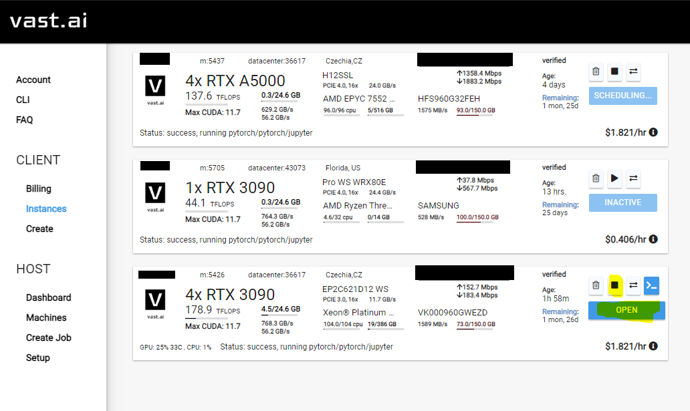
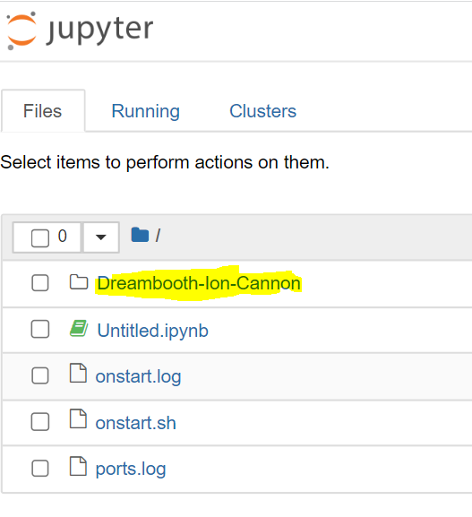
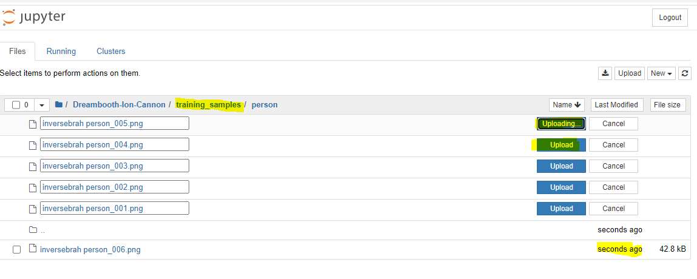
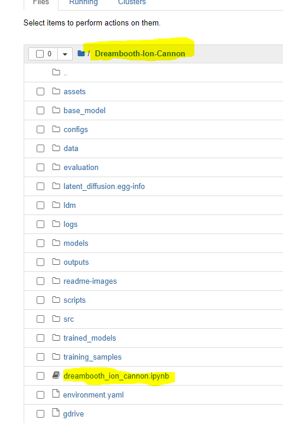
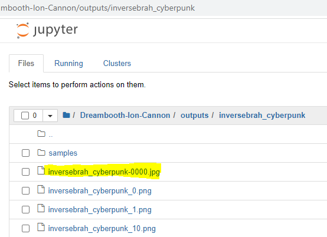

# Dreambooth Ion Cannon

## Purpose

The Dreambooth Ion Cannon is a repository that abstracts away a large chunk of the execution pain points of [The Repo Formerly Known As Dreambooth](https://github.com/JoePenna/Dreambooth-Stable-Diffusion), providing a layperson an easily accessible guide to uploading photographs, training a Stable Diffusion model on said photographs, and generating images according to pre-selected prompts.

This repo (and _particularly_ this `README`) should be considered under active development until such time as this line of text disappears, so please pop in every so often in case things still appear piecemeal. I will be adding new prompts on occasion to the model (and have several ideas on how to smooth the path to training multi-subject models), so be aware that this is very much a construction zone.

After finishing the guide (again, active work if you're reading this line), I'll add some points on how to search for prompts and run them yourself using this repository - if you find any that you are particularly impressed with, [tag me on Twitter](https://twitter.com/functi0nZer0) with a screenshot as well as the prompt text and the seed, and I'll consider them for inclusion!

## Disclaimer

I must reiterate here - the _vast_ majority of this code is not my work.

This repository is a fork of a fork of a fork, with the original by Xavier Xiao found [here](https://github.com/XavierXiao/Dreambooth-Stable-Diffusion), the work of Joe Penna et al found [here](https://github.com/JoePenna/Dreambooth-Stable-Diffusion), and the work of Kane Wallmann found [here](https://github.com/KaneWallmann/Dreambooth-Stable-Diffusion).

In the interests of simplicity, I have removed all text in this README that is not directly related to how to use this repository. If you have issues with image quality etc, please read through Kane's repository (as it contains notes from all parties involved). There is a lot of wonderfully insightful stuff in there.

I am focusing the below 'how-to' on [Vast.AI](https://vast.ai) as the provisioning platform for GPU compute, simply because when I was trying this out, that was the platform that had resources available. Joe has asked folk to utilise RunPod [with his referral link](https://runpod.io/?ref=n8yfwyum), which allows him to continue his work without paying for it - if you're more technically inclined and feel confident that you can run a Jupyter notebook with Pytorch in a platform-agnostic manner, I strongly recommend you do so in order to show support.

## Controlling The Ion Cannon

This section is under live construction: if you're confused, come back in a bit - if you're still confused, ping me on Twitter and let me know what part you're struggling with!

### Step 0

You're going to want to sign up to [Vast.AI](https://vast.ai), log in, and add a payment method.

I'm not going to hand-hold you through how to do that, as it's a website with a sophisticated UX, and it uses Stripe and Crypto.com as its payment rails. I've been following Joe's advice and adding credit in US$10 increments - that will be more than enough for you to start.

### Step 1

Once you're logged in and have some credit available, go to the `Create` section of the Console.

Here, you'll want to make sure that the image (pre-installed software on a new instance you create) has Pytorch available on it. 

Click on `Edit Image & Config...`, highlighted below. Note that I've edited the required disk space to be 150 GB - this is _far_ in excess of what you'll need, but space costs mere pennies. Stick with about 50 GB if you're not a spendthrift, that'll do fine.
 

### Step 2

Ensure that you've selected `PyTorch`. The 'what it is' is ably explained in the below screenshot: it's a deep-learning framework. You need it.

Previous iterations of this repository have suggested checking the Jupyter lab interface and direct HTTPS options, but to be honest, when I was setting all of this up, I forgot to do it, and it's simple enough to work through without it (this advice may change when I finally get around to trying it out).

### Step 3

Now you need to rent out some hardware to actually run things on.

I tend to select `Only datacenters` as a filter because the instances that are available there are _very_ fast to spin up - in the range of seconds - and have solid bandwidth: the price per hour reflects this, even though it only amounts to a couple of cents per hour. You're free to not do this, of course, but note that if you don't you might find your instance taking a very long time to get started.

One **critical** choice you need to make is that whatever you rent _must_ have 24 GB VRAM (highlighted below). Beyond that, you're free to select whichever one is cheapest: this will work on even a single card (i.e. you might as well aim for whichever one is cheapest, I've not looked too hard into adding any fancy parallelisation stuff yet).

When you've found the one you want, hit `Rent`. You'll get a little popup informing you as much.

### Step 4

#### Step 20

Stare into the void.

